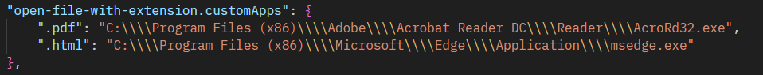

# 📂 Open With Custom Editor

A Visual Studio Code extension that allows you to open files with specific applications based on their file extensions. Configure your preferred applications for different file types and open files directly from VS Code.

## ✨ Features
- 🖱️ Open files with custom applications based on their extensions.
- ⚙️ Fully configurable through VS Code settings.
- 🚀 Quick and seamless integration into your workflow.

## 📖 How to Use It

### 1️⃣ Configure Custom Applications
1. Open the **Settings** in VS Code.
2. Search for `open-file-with-extension`.
3. Add your custom applications in the following format:
   ```json
   "open-file-with-extension.customApps":
   {
       ".txt": "C:\\Program Files\\Notepad++\\notepad++.exe",
       ".jpg": "C:\\Program Files\\IrfanView\\i_view64.exe"
   }
   ```

### 2️⃣ Open a File
1. Right-click on a file in the Explorer or use the Command Palette (`Ctrl+Shift+P` or `Cmd+Shift+P`).
2. Select the command: **Open File With Custom Application**.
3. The file will open in the configured application for its extension.

## 🛠️ Requirements
- Ensure the applications you configure are installed and accessible from your system.

## 💡 Example
- `.txt` files open in **Notepad++**.
- `.jpg` files open in **IrfanView**.


## 🧩 Extension Settings
This extension contributes the following settings:
- `open-file-with-extension.customApps`: A mapping of file extensions to application paths.


## 🤝 Contributing
Feel free to submit issues or pull requests to improve this extension.

## 📜 License
This project is licensed under the MIT License.
